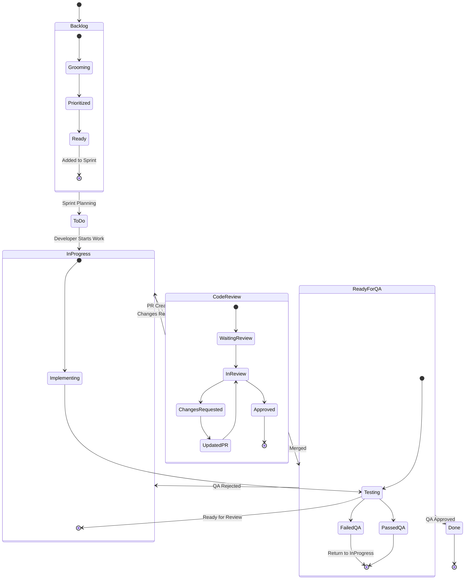
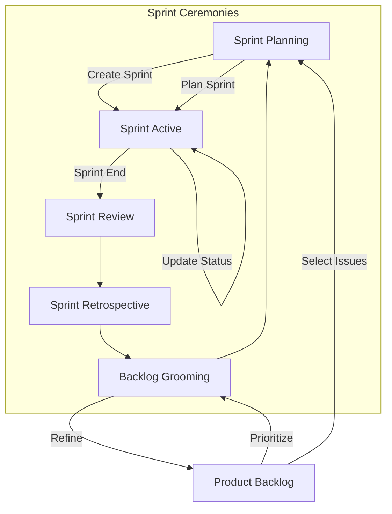
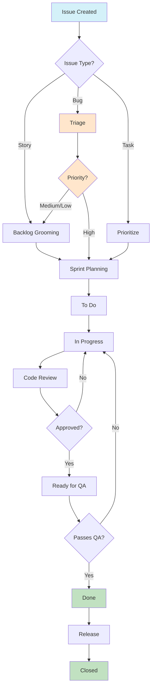
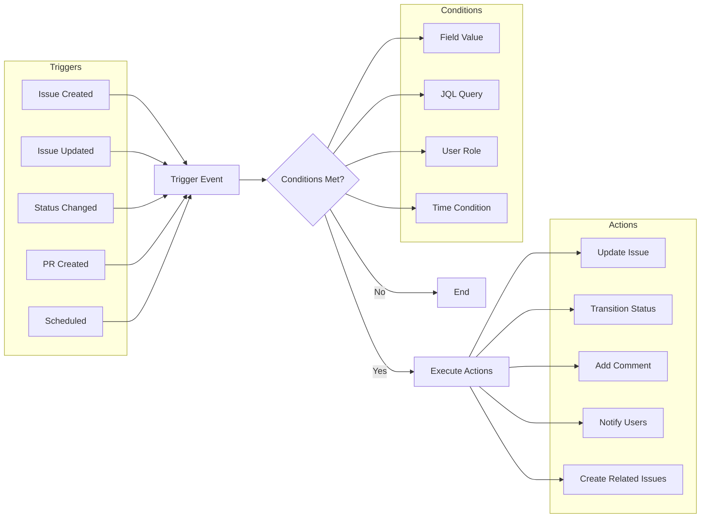
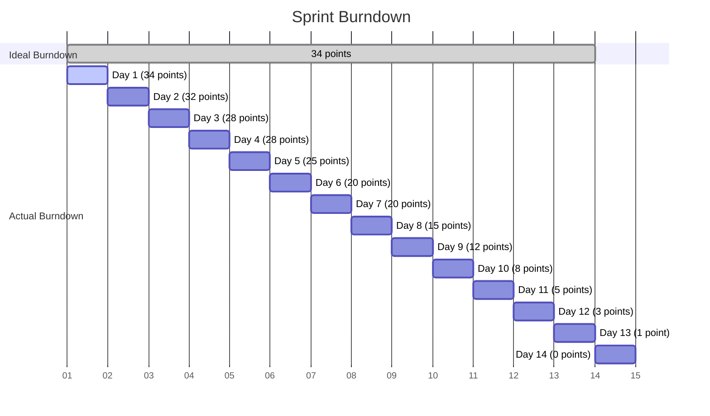
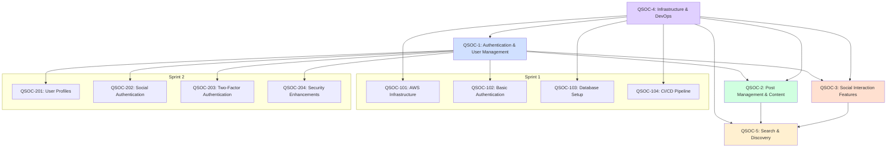
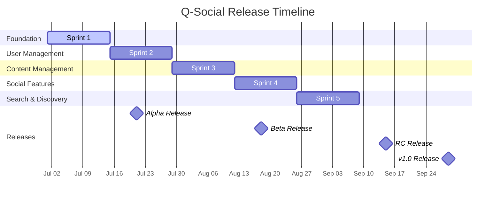
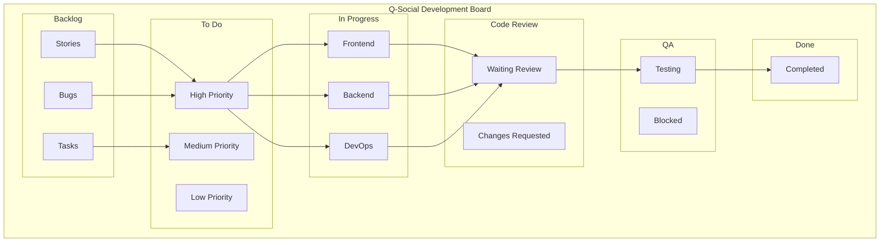
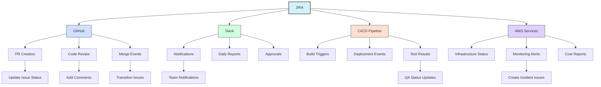

# Q-Social JIRA Workflow Diagrams

## Issue Workflow Diagram



## Sprint Workflow Diagram



## Issue Lifecycle Diagram



## Automation Rules Flow



## Sprint Burndown Chart



## Epic Relationship Diagram



## Team Velocity Chart

```mermaid
xychart-beta
    title "Team Velocity Over Sprints"
    x-axis [1, 2, 3, 4, 5, 6, 7, 8]
    y-axis "Story Points" 0 --> 50
    bar [25, 28, 30, 34, 36, 38, 40, 42]
    line [34, 34, 34, 34, 34, 34, 34, 34]
    
    title-color: #333
    x-axis-color: #333
    y-axis-color: #333
    stroke-color: #f00
    stroke-width: 2
    grid-color: #ccc
```

## Release Planning Timeline



## Issue Type Workflow Variations

```mermaid
stateDiagram-v2
    [*] --> Backlog
    
    state "Story Workflow" as SW {
        Backlog --> ToDo
        ToDo --> InProgress
        InProgress --> CodeReview
        CodeReview --> ReadyForQA
        ReadyForQA --> Done
    }
    
    state "Bug Workflow" as BW {
        Backlog --> Triage
        Triage --> ToDo
        ToDo --> InProgress
        InProgress --> CodeReview
        CodeReview --> ReadyForQA
        ReadyForQA --> Verified
        Verified --> Done
    }
    
    state "Task Workflow" as TW {
        Backlog --> ToDo
        ToDo --> InProgress
        InProgress --> Done
    }
    
    Done --> [*]
```

## JIRA Board Layout



## Automation Integration Map


